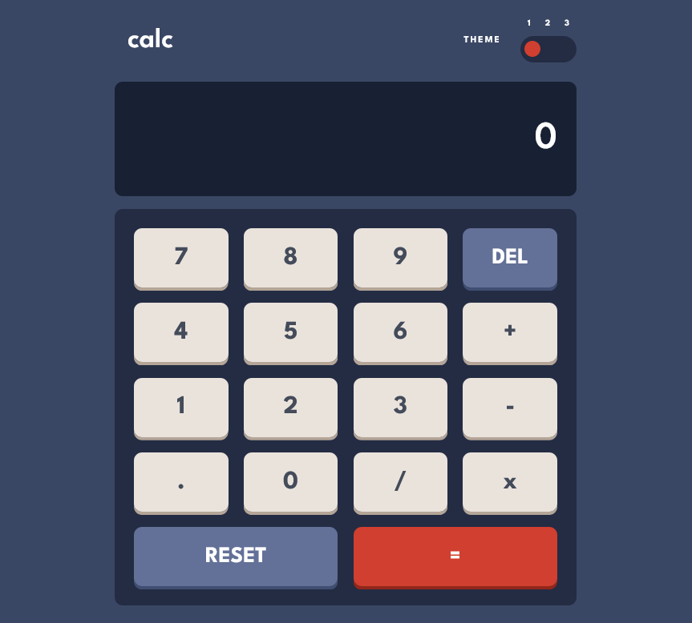
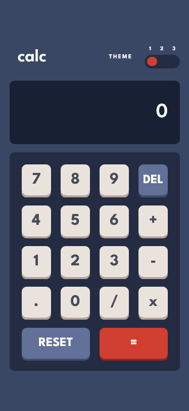

# Frontend Mentor - Calculator app solution

This is a solution to the [Calculator app challenge on Frontend Mentor](https://www.frontendmentor.io/challenges/calculator-app-9lteq5N29).

## Table of contents

- [Overview](#overview)
  - [The challenge](#the-challenge)
  - [Screenshot](#screenshot)
  - [Links](#links)
  - [Test In You Own Computer](#Test In You Own Computer)
- [My process](#my-process)
  - [Built with](#built-with)
  - [What I learned](#what-i-learned)
  - [Useful resources](#useful-resources)
- [Author](#author)

## Overview

### The challenge

Users should be able to:

- See the size of the elements adjust based on their device's screen size
- Perform mathmatical operations like addition, subtraction, multiplication, and division
- Adjust the color theme based on their preference
- **Bonus**: Have their initial theme preference checked using `prefers-color-scheme` and have any additional changes saved in the browser

### Screenshot

Desktop View



Mobile View




### Links

- Solution URL: [View Code Source](https://github.com/JulianG1808/Calculator-App-React)
- Live Site URL: [Add live site URL here](https://your-live-site-url.com)

### Test In You Own Computer

1. Clone this source code using the next URL `https://github.com/JulianG1808/Calculator-App-React.git` in a terminal like **GIT Bash** or another.
3. Go to the folder **calculator-app-react** from your **terminal**.
4. Execute the command `npm install` for install all the dependencies of the project.
5. Execute the command `npm start`.
7. Congratulations, you are viewing my weather app from your own computer.

## My process

### Built with

- JavaScript
- [React](https://reactjs.org/)
- HTML5
- [SASS](https://sass-lang.com/)
- Flexbox
- Grid

### What I learned

I learned about Context in React, used it for in-page themes.
Also learned how to use CSS Grid. I used this on a keyboard for the calculator. this is the code for make possible this:

```html
<div className="keyboard">
  <button className="keys" >7</button>
  <button className="keys" >8</button>
  <button className="keys" >9</button>
  <button className="keys_delete" >DEL</button>
  <button className="keys" >4</button>
  <button className="keys" >5</button>
  <button className="keys" >6</button>
  <button className="keys" >+</button>
  <button className="keys" >1</button>
  <button className="keys" >2</button>
  <button className="keys" >3</button>
  <button className="keys" >-</button>
  <button className="keys" >.</button>
  <button className="keys" >0</button>
  <button className="keys" >/</button>
  <button className="keys" >x</button>
  <button className="keys_reset" >RESET</button>
  <button className="keys_equal" >=</button>
</div>
```
```scss
.keyboard {
  display: grid;
  grid-template-rows: repeat(5, 1fr);
  grid-template-columns: repeat(4, 1fr);
  gap: 1.2em;
  justify-content: center;
  align-items: center;
}
```

### Useful resources

- [Context React](https://reactjs.org/docs/context.html)
- [Grid](https://developer.mozilla.org/es/docs/Web/CSS/CSS_Grid_Layout)
- [eval()](https://developer.mozilla.org/en-US/docs/Web/JavaScript/Reference/Global_Objects/eval)
- [Center a element with Flexbox and Grid](https://www.freecodecamp.org/espanol/news/como-centrar-cualquier-cosa-en-css-usando-flexbox-y-grid/)


## Author

- [Frontend Mentor](https://www.frontendmentor.io/profile/JulianG1808)
- [Portfolio](https://portfolio-julian.vercel.app/)
- [LinkedIn](https://www.linkedin.com/in/leandrojuliangomez/)
- [GitHub](https://github.com/JulianG1808)
